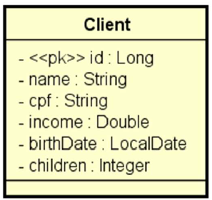

# DESAFIO: CRUD de clientes

## Objetivo
Desenvolver um projeto Spring Boot contendo um CRUD completo de web services REST para
acessar um recurso de clientes. O projeto deve estar com um ambiente de testes configurado acessando o banco de dados H2, deverá usar
Maven como gerenciador de dependência, e Java como linguagem.

## Entidade

Todos os direitos reservados ao [DevSuperior](https://devsuperior.club/)